# 🚀 API de Ejemplo con Flask

Este proyecto es una API simple desarrollada en **Python + Flask** que incluye varios endpoints de ejemplo:

- **Hola Mundo**
- **Película aleatoria de Netflix** (usando TMDb API)
- **Pokémon aleatorio** (usando PokéAPI)

---

## 📌 Endpoints disponibles

### 1. Hola Mundo
```
GET /api/hola
```
**Respuesta:**
```json
{ "mensaje": "Hola Mundo" }
```

---

### 2. Película aleatoria en Netflix
```
GET /api/netflix/random
```
Devuelve una película aleatoria disponible en Netflix (según TMDb).

**Ejemplo de respuesta:**
```json
{
  "titulo": "El Irlandés",
  "descripcion": "Frank Sheeran, veterano de la Segunda Guerra Mundial...",
  "poster": "https://image.tmdb.org/t/p/w500/xxxx.jpg",
  "link_tmdb": "https://www.themoviedb.org/movie/398978"
}
```

---

### 3. Pokémon aleatorio
```
GET /api/pokemon/random
```
Devuelve un Pokémon aleatorio con datos básicos desde PokéAPI.

**Ejemplo de respuesta:**
```json
{
  "nombre": "pikachu",
  "altura": 4,
  "peso": 60,
  "sprites": "https://raw.githubusercontent.com/PokeAPI/sprites/master/sprites/pokemon/25.png",
  "link_pokeapi": "https://pokeapi.co/api/v2/pokemon/25/"
}
```


## 🖼️ Captura de ejemplo

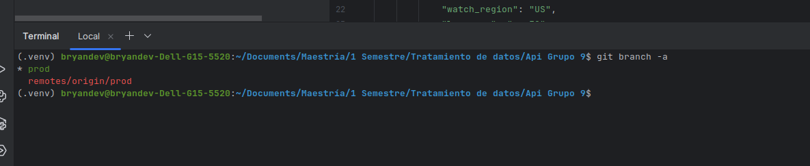

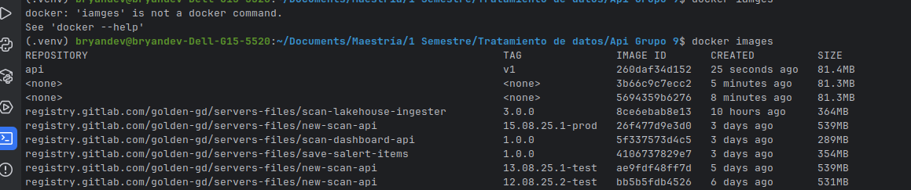

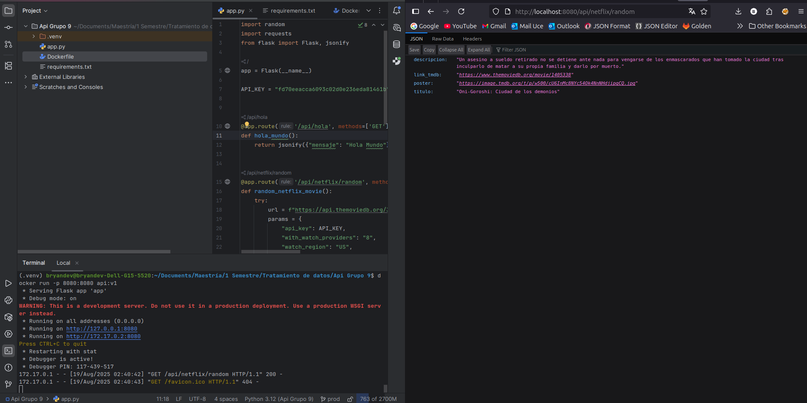

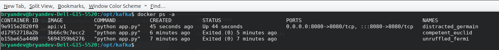

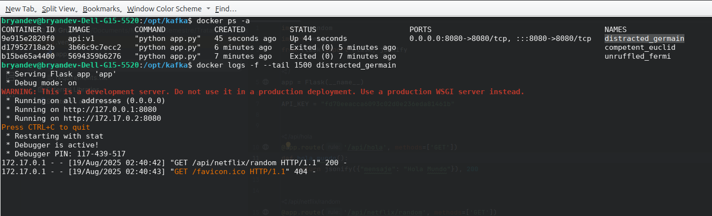

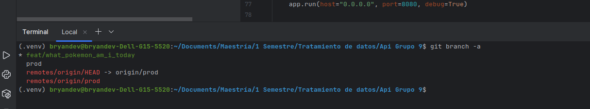

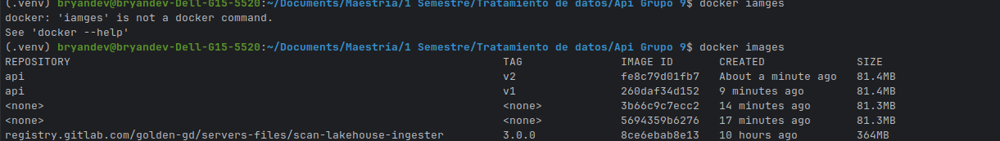

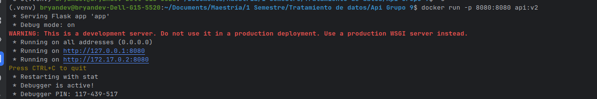

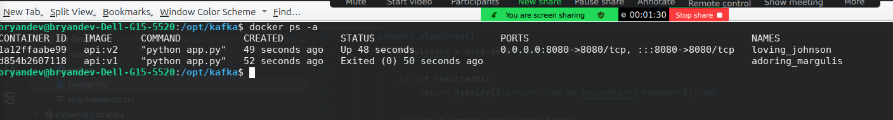

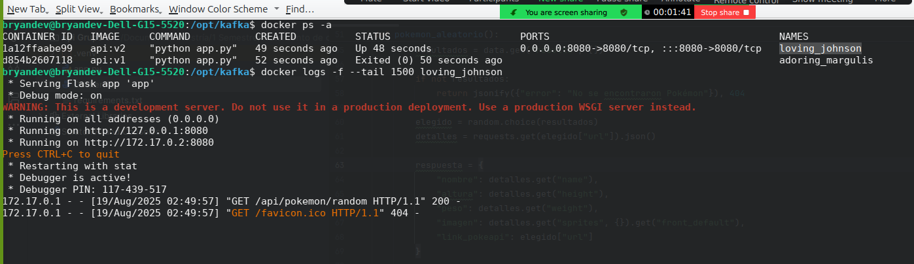

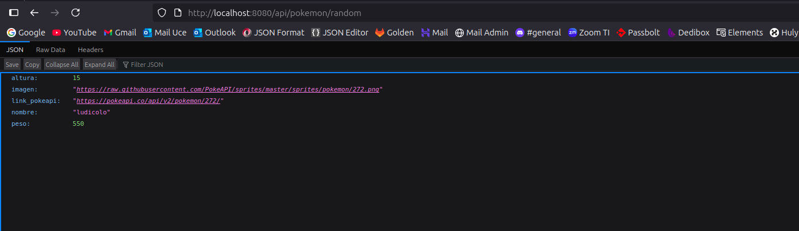


---

## 📜 Licencia
Este proyecto es de uso libre para fines educativos y de práctica.